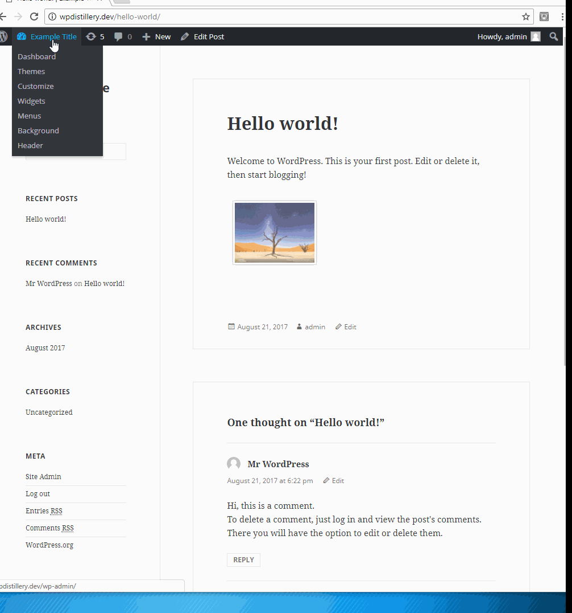

# Cybersecurity Lab 7 - *WordPress Pentesting Setup* 

Time spent: **20** hours spent in total 

## User Stories

The following **required** functionality is completed:

1. [X]  Required: Milestone 0 - Preparing the Playing Field
2. [X]  Required: Milestone 1 - Opening an Attack Surface
3. [X]  Required: Milestone 2 - Recon
4. [X]  Required: Milestone 3 - Hello, Metasploit
5. []  Required: Milestone 4 - Pwnage
6. []  Required: Milestone 5 - Tag it
7. []  Required: Milestone 6 - Going Deeper
8. []  Required: Milestone 7 - Hello, sqlmap

The following advanced user stories are optional:

* []  Bonus 1: sqlmap vs. SecurityShepherd  
* []  Bonus 2: Watch and Learn 

## Video Walkthrough

Here's a walkthrough of implemented user stories:

GIF created with [LiceCap](http://www.cockos.com/licecap/).

## Notes

## License

    Copyright [2017] [Gregory Szymanski]

    Licensed under the Apache License, Version 2.0 (the "License");
    you may not use this file except in compliance with the License.
    You may obtain a copy of the License at

        http://www.apache.org/licenses/LICENSE-2.0

    Unless required by applicable law or agreed to in writing, software
    distributed under the License is distributed on an "AS IS" BASIS,
    WITHOUT WARRANTIES OR CONDITIONS OF ANY KIND, either express or implied.
    See the License for the specific language governing permissions and
    limitations under the License.
